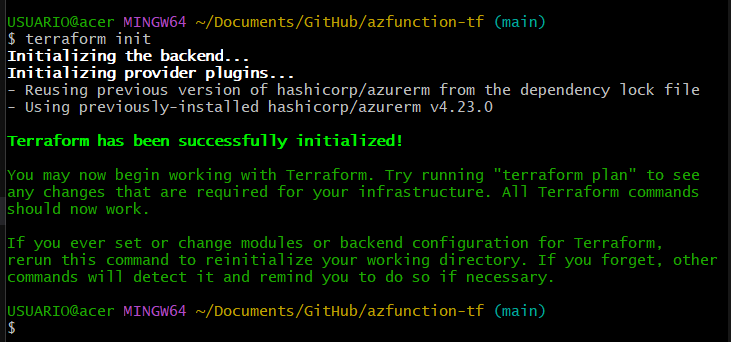
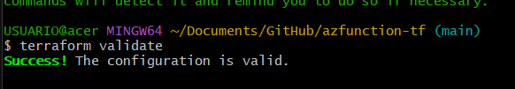
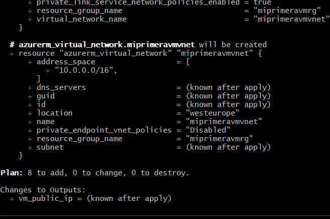
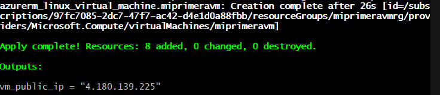
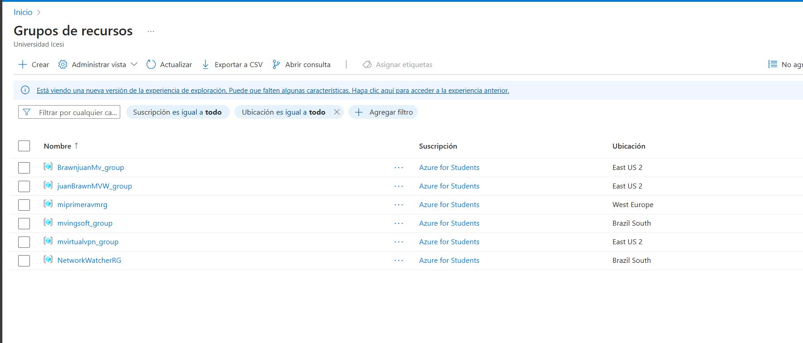
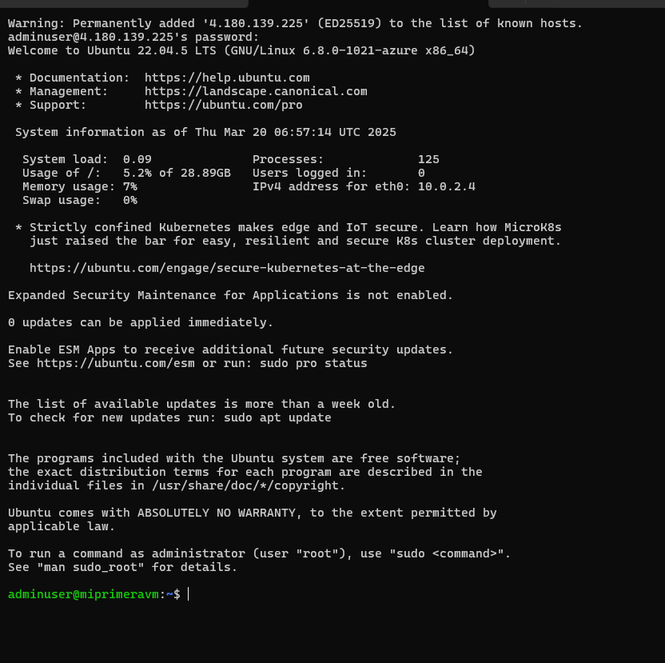
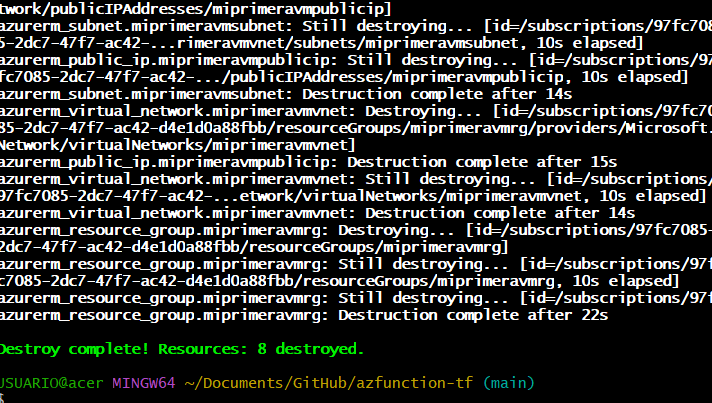

 ## 1.Inicializar Terraform

Ejecutamos el siguiente comando para inicializar Terraform en el directorio del proyecto:

```sh
terraform init
```


## 2. Validar la configuración de Terraform

Verificamos que la sintaxis de los archivos de configuración de Terraform sea correcta:

```sh
terraform validate
```


## 3, Ver el plan de ejecución

Genera un plan de ejecución para ver qué cambios se aplicarán en la infraestructura:

```sh
terraform plan
```



## 4  Aplicar la configuración

Para desplegar la infraestructura en Azure
```sh
terraform apply
```




## 5 Nos conectamos a la vm



## 6 Eliminar la infraestructura (opcional)

para eliminar todos los recursos creados, se usa

```sh
terraform destroy
```
