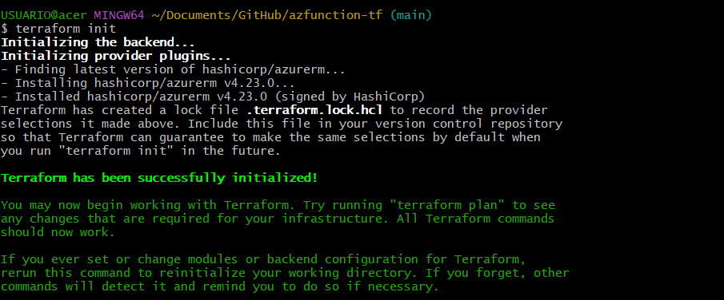
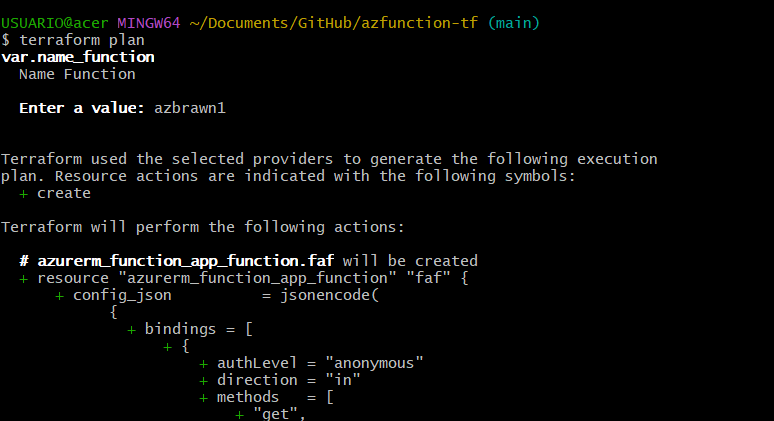
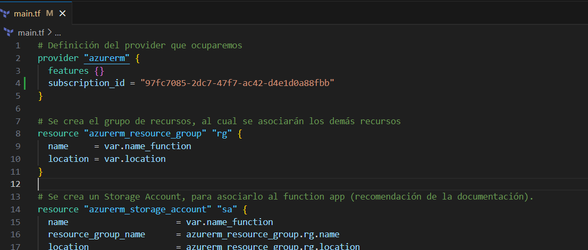
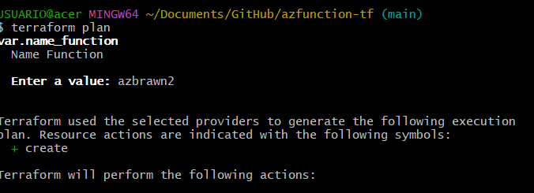
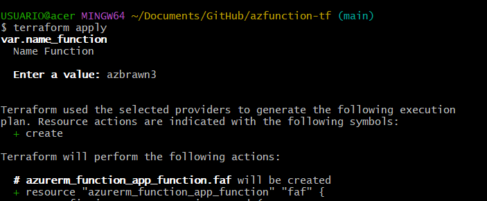
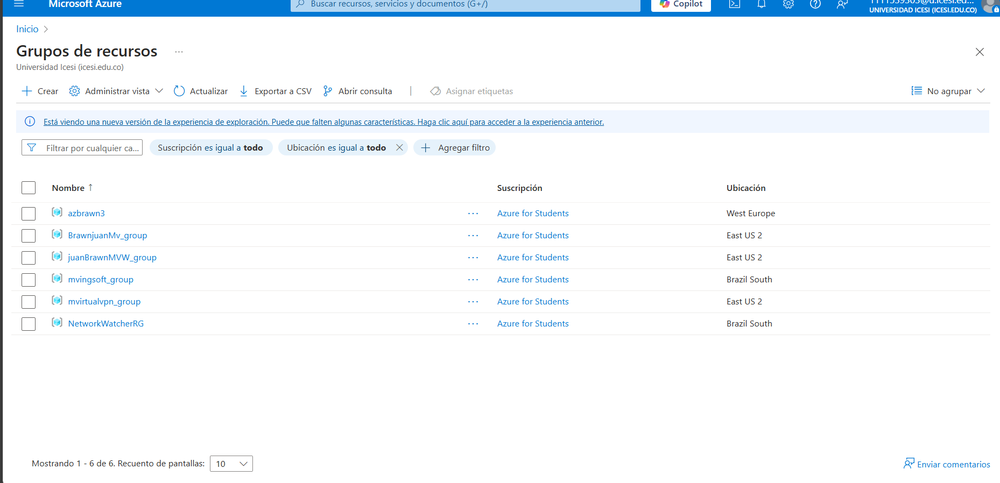
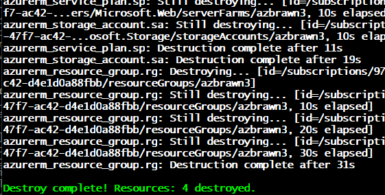

Aquí tienes la documentación con los comandos correctamente incluidos y adaptados a tu caso específico:

---

# Implementación de Azure Function con Terraform

Este documento detalla los pasos para desplegar una Azure Function en Azure utilizando Terraform.


## Pasos de Implementación

### 1. Clonar el repositorio

Ejecuta el siguiente comando para clonar el repositorio con la configuración de Terraform:

```sh
git clone https://github.com/ChristianFlor/azfunction-tf.git
cd azfunction-tf
```

### 2. Abrir el proyecto en Visual Studio Code

```sh
code .
```

### 3. Autenticarse en Azure

iniciamos nuestra cuenta de azure:

```sh
az login
```

Esto abrirá el navegador y pedirá que inicies sesión con tu cuenta de Azure.

### 4. Inicializar Terraform

Ejecutamos el siguiente comando para inicializar Terraform en el directorio del proyecto:

```sh
terraform init
```


### 5. Validar la configuración de Terraform

Verificamos que la sintaxis de los archivos de configuración de Terraform sea correcta:

```sh
terraform validate
```


### 6. Ver el plan de ejecución

Genera un plan de ejecución para ver qué cambios se aplicarán en la infraestructura:

```sh
terraform plan
```



### 7. Obtener el ID de la suscripción de Azure

Ejecutamos el siguiente comando para obtener tu ID de suscripción en Azure:

```sh
az account show
```

La salida mostrará un JSON donde encontrarás el `id` de la suscripción. Para este caso, el ID es:

```
97fc7085-2dc7-47f7-ac42-d4e1d0a88fbb
```

### 8. Agregar el ID de suscripción en `main.tf`

Editamos el archivo `main.tf`

```hcl
subscription_id = "97fc7085-2dc7-47f7-ac42-d4e1d0a88fbb"
```


### 9. Verificar el plan de ejecución nuevamente

Después de agregar el ID de suscripción volvemos a ajecutar

```sh
terraform plan
```

### 10. Aplicar la configuración

Para desplegar la infraestructura en Azure
```sh
terraform apply
```



### 11. Verificar el despliegue

Una vez aplicada la infraestructura, la función estará disponible



### 12. Eliminar la infraestructura (opcional)

para eliminar todos los recursos creados, se usa

```sh
terraform destroy
```



---
